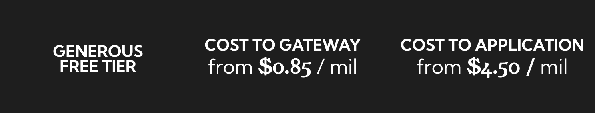

# POCKET NETWORK DOCUMENTATION

Here you'll find documentation about all things pocket,__the base RPC layer for Web3.__

>"The world wide web is generally divided into two parts the producers of data and the consumers of data.
Pocket network is the pipe through which this data is transmitted."

This vital piece of infrastructure that pocket network provides is owned and operated 
by the community giving it's users **_unstoppable access to open data._**

✨We hope you create magic with pocket ✨

Read on to learn more about our ecosystem.

***

### What is pocket network

Pocket network is a DePin(Decentralized physical infrastructure) protocol made up of 5 parts : - 

##### Blockchains
Blockchains form the data layer,any chain that uses RPC is compatible with pocket protocol so far we have support for 40+ chains and growing...🔥🔥🔥
##### Users
Our users in the context of pocket network are the data consumers they form the demand side of the protocol.The network majorly serves 3 use cases best :-
+ RPC Providers
+ Developers
+ Web3 applications

We have so far served over 650 Billion relays...🎉🎉🎉
##### Node runners
They secure and confirm the network transactions.
Backed by 20,000+ independent, globally distributed node the network provides 99.99% uptime with a latency of less than 50ms across 40+ blockchain protocols...👏👏👏

##### Gateways
Gateways are the access point through which the users access the underlying data in the blockchains.
We currently have two operational gateways [Nodies](https://www.nodies.app/) and [Grove](https://www.grove.city/).
As we look to bring permissionless gateways post V1 launch...🎆🎆🎆
##### Contributors
These are individuals who bring their skills and expertise and contribute to the growth of the network

*** 
### Pocket utility

The project started in 2017.&#x20;

At that time c.90% of relays were running through one centralized RPC service.Web3 needed a decentralized alternative. We started building DePIN long before DePIN got cool.

As of today, we have served over 650bn data requests for over 40 blockchains, using a global network of c.17k nodes distributed across 22 different countries.

<figure><figcaption></figcaption></figure>

***

### Pocket economics

Infrastructure is one of the places where decentralization unlocks big performance benefits.&#x20;
The current operational gateways on the network have managed to bring RPC cost to a mere $4.50 per million request,whilst boasting a generous free tier.

<figure><figcaption></figcaption></figure>

At the centre of the network is *__pocket token__*,that incentives the pocket ecosystem by charging a fee to the gateways that plug into the protocol.

***

### Pocket governance

### Browse Documentation

### Contribution guide

