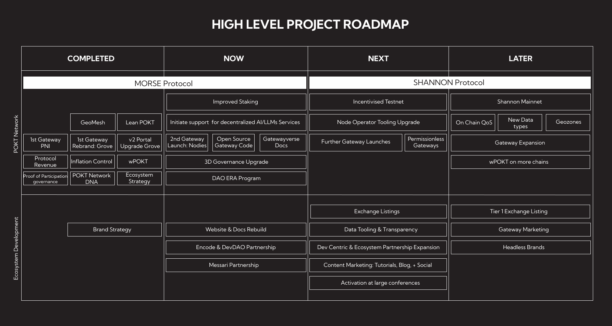

# Welcome to POKT Network

Here you'll find documentation about all things pocket,**the base RPC layer for Web3.**

> "The world wide web is generally divided into two parts the producers of data and the consumers of data. Pocket network is the pipe through which this data is transmitted."

This vital piece of infrastructure that pocket network provides is owned and operated by the community giving it's users _**unstoppable access to open data.**_

✨We hope you create magic with pocket ✨

Read on to learn more about our ecosystem.

***

### What is pocket network

Pocket network is a DePin(Decentralized physical infrastructure) protocol made up of 5 parts : -

**Blockchains**

Blockchains form the data layer,any chain that uses RPC is compatible with pocket protocol so far we have support for 50+ chains and growing...🔥🔥🔥

**Users**

Our users in the context of pocket network are the data consumers they form the demand side of the protocol.The network majorly serves 3 use cases best :-

* RPC Providers
* Developers
* Web3 applications

We have so far served over 650 Billion relays...🎉🎉🎉

**Node runners**

They secure and confirm the network transactions. Backed by 20,000+ independent, globally distributed node the network provides 99.99% uptime with a latency of less than 50ms across 40+ blockchain protocols...👏👏👏

**Gateways**

Gateways are the access point through which the users access the underlying data in the blockchains. We currently have two operational gateways [Nodies](https://www.nodies.app/) and [Grove](https://www.grove.city/). As we look to bring permissionless gateways post V1 launch...🎆🎆🎆

**Contributors**

These are individuals who bring their skills and expertise and contribute to the growth of the network

***

### Pocket utility

The project started in 2017.

At that time c.90% of relays were running through one centralized RPC service.Web3 needed a decentralized alternative. We started building DePIN long before DePIN got cool.

As of today, we have served over 650bn data requests for over 40 blockchains, using a global network of c.17k nodes distributed across 22 different countries.

<figure><figcaption></figcaption></figure>

***

### Pocket economics

Infrastructure is one of the places where decentralization unlocks big performance benefits. The current operational gateways on the network have managed to bring RPC cost to a mere $4.50 per million request,whilst boasting a generous free tier.

<figure><figcaption></figcaption></figure>

At the centre of the network is _**pocket token**_,that incentives the pocket ecosystem by charging a fee to the gateways that plug into the protocol.

***

### Pocket governance

Pocket network is governed by a highly functional and transaprent DAO that encompasses the Pocket DNA.

> Pocket’s purpose is to provide Unstoppable Open Data to enable a future where the world’s most important digital infrastructure is governed by its users. ---Pocket DNA

To fullfill the above vision,the DAO operates through ERA. ERA provide a mechanism of “Cycles” to operate transparently and to learn and iterate, but without major distraction from the core role of executing,ERAs have enabled the DAO to fund priority projects towards a shared ambition. The Era Budget makes funds available to contributors through our contribution mechanisms:

* IDEAS (Community Suggestions)
* Bounties (Supporting Keystone projects, protocol development or other key tasks)
* Sockets (Rapid, permissionless seed grants)
* POPs (Pocket Open Priorities, like RFPs)

<figure><figcaption></figcaption></figure>

***

### Browse Documentation

Here you will find documentation about all the segments of pocket ecosystem the base RPC layer for Web3.

**Mission**

Empower developers with access to the most reliable,performant and cost-effective data.

**Vision**

A future where the world's most important digital infrastructure is owned and governed by its users.

**Purpose**

Provide the world with unstoppable open data.

#### Roadmap

We have a roadmap that enables us to stay on course to achieve the above and make pocket a vital piece of Web3 infrastructure.

<figure><figcaption></figcaption></figure>

[Official roadmap](welcome-to-pokt-network/roadmap-docs.md)

#### Pocket Users

Pocket users are divided into three major categories : -

* RPC Providers These are bussinesses or individuals providing RPC services they interface with the protocol through Gateways.
  * [Gateways](get-rpcs/) Gateways are a major part of the network they are the taps through which the data is served we currently have two operational gateways
    * Grove - Get a grove [endpoint](get-rpcs/find-a-gateway/grove.md)
    * Nodies - Get a nodies [endpoint](get-rpcs/find-a-gateway/nodies.md)
  * [Host a gateway](get-rpcs/build-a-gateway/) It is permissionless and easy to run gateways on pocket network and this will be available post V1 launch. [Early Access](get-rpcs/build-a-gateway/early-access.md) [Gateway Kit](get-rpcs/build-a-gateway/gateway-kit.md)
* Web 3 App and Developers Developers and Web3 applications make the consumer base of pocket network.They make the RPC requests to the blockchain data made available by the gateways. You can get generous free tier from any of our exisitng gateways
  * [Use a Public Endpoint](get-rpcs/public-endpoints.md)
  * [Grove gateway](get-rpcs/find-a-gateway/grove.md)
  * [Nodies](get-rpcs/find-a-gateway/nodies.md)

<figure><figcaption></figcaption></figure>

* Blockchains Blockchains form the data layer of pocket network,it is from this data layer that RPC requests are served. Pocket network currently supports any chains that has support for RPC standard. Node runners are at the center of mantaining the health and availablilty of these chains and in return they get pocket token. We currently support 51 chains and the list still grows.
  * [Run a node](supply-rpcs/) Node runners play a vital role as they serve RPC request and secure the network. To run a node you need atleast 15,100 pocket tokens. Rewards are computed per chain per request served.
    * [Staking](./)
      * [Servicer nodes](./)
      * [Validator nodes](./)
    * [Custodial staking](./)
    * [Non custodial staking](./)
    * [Supported chains](welcome-to-pokt-network/supported-chains.md)
    * [Chain rewards](./)
  * Pocket pools There are different pools that enable individuals to stake their pocket token and earn pocket token.They include :-
    * [List of pools](./)

#### Pocket token

At the center of pocket ecosystem is pocket token. It is a conditional deflationary token that is native to pocket network.

* Token Economics - Read more about the economics of the network. [Economics](./)
  * Get Pocket token - [Markets](./)
  * Swap Pocket to get wPokt - [Uniswap](./) wPokt is a wrap of 1:1 token with pocket on Ethereum chain. [Swap](./)
  * Earn with Pocket
    * Provide liquidity - [wPokt/Eth Pool](./)
    * Stake pocket - [Staking pools](./)
    * Run pocket nodes - [Run node](./)

#### Pocket Governance

* DAO The network and the ecosystem is governed by a highly functional DAO...
  * How to get a DAO vote. [Pocket citizenship](./)
    * DAO Budgets. Every cycle different keystone projects are funded by the DAO,through POPs,IDEAS,Sockets and Bounties.
      * POPs
        * [Open Pops](./)
        * [Passed Pops](./)
        * [Create Pops](./)
      * Sockets
        * [Open Sockets](./)
        * [Previous Sockets](./)
        * [Create Socket](./)
      * Bounties
        * [Open Bounties](./)
        * [Key projects](./)
        * [Key tasks](./)
      * IDEAs
        * [Submit an idea](./)

#### Tech Stack

#### Additional links

* Pocket Search
* Messari report
* Discord
* Twitter
* Forum

***

### Contribution guide

This documentation grows every day you are welcome to [contribute](contribute/)
