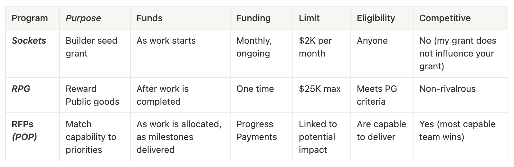

# CONTRIBUTE

There are 3 key ways to contribute at POKT Network.

* **Open RFPs:** these are typically bigger projects that are open to anyone with the right skills.
* **Quick Grants (formerly Sockets):** DAO citizens who spot a need can start working to fill it, permissionlessly.
* **Retroactive Public Goods (RPG):** grants to projects that benefit us all

You can find out more about each of these and the broader GROW program [here 17](https://forum.pokt.network/t/grow-grants-rewards-opportunities-work/3994)

<figure><figcaption></figcaption></figure>

We are also looking to renew the previous bounty program to make it easier for people to contribute in ways that will help build our momentum.

* **Bounties:** usually smaller pieces of work that can be a great way to get known.

### Open RFPs

Current Requests for Proposals (RFPs) can be found [here](https://forum.pokt.network/c/build/pop/120) on our forum.&#x20;

Each POP will include:

1. **Requirements:** _the objective and requirements, plus details needed from submissions._
2. **Submission period:** _period during which submissions can and will be accepted._&#x20;
3. **Review period:** _time during which PNF (or the DAO) will review submissions and report on decisions and reasoning._

Some examples of recent POPs include:

* [Website Rebuild](https://forum.pokt.network/t/allocated-priority-website-rebuild/4711?u=adrienne): delivered by [Raid Guild](https://www.raidguild.org/)
* [Metrics Dashboard](https://forum.pokt.network/t/allocated-priority-pocket-network-ecosystem-metrics-dashboard/4594?u=adrienne): delivered by [TogetherCrew](https://www.togethercrew.com/)

### Quick Grants (formerly Sockets)

These are small seed grants to support builders and contributors who have ideas about how to drive impact towards the priorities of POKT Network.&#x20;

They are open to anyone in our community who comes with measurable initiatives that we can keep them accountable to. These will move the responsibility for contributors from writing great proposals and being part-time politicians to generating impactful ideas and delivering on them.

These are likely to be spun up quickly to experiment, learn and innovate, and just as likely to be wound down within weeks when the socket is no longer generating ROI for the DAO.

A grant can be opened to support one of the [Ambitions 5](https://forum.pokt.network/uploads/default/original/2X/6/6606f2f32ca26513257cda76400825bcaac7ac14.jpeg) of the latest [Era 4](https://forum.pokt.network/t/a-new-era-in-dao-operations/4418).

Type of Socket:

* Trial: $500 for 2 week trial of something
* Experiment/Initiative: $1-2K, paid and reviewed monthly, for the life of the experiment

### Retroactive Public Goods

RPGs enable the community to identify projects that contribute to the public good and be baid to execute them.&#x20;

Many projects deliver benefit to all of us, often beyond what they have received to build, maintain and improve these products over time.&#x20;

RPG is a method to reward people more fairly for the creation of these public goods and to take us all into deeper discussion around the types of altruistic contributions that have made POKT Network what it is today.

### Bounties

We are currently renewing the bounty framework - watch this space!

