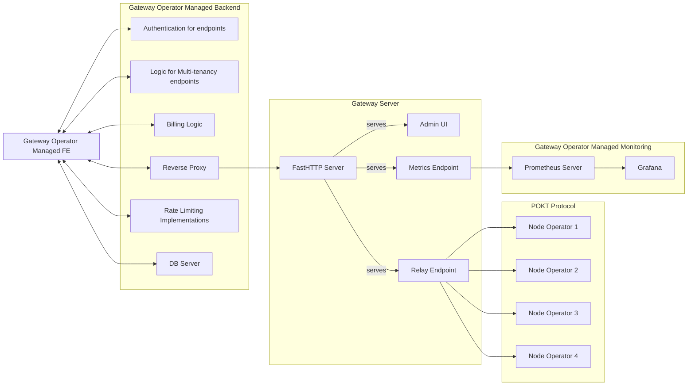

# Gateway Server

The Gateway Server enables developers of all kinds to interact with the POKT Network protocol and engage with 50+ blockchains without the need to store terabytes of data, require heavy computational power, or understand the POKT Network protocol specifications.

POKT Network's self-hosted Gateway Server is a lightweight [gRPC](https://grpc.io) client that integrates with the POKT Network protocol and maintains a familiar HTTP JSON-RPC Server interface for your applications (and any customer applications) to send and receive RPC requests. The Gateway Server abstracts away the complexities of directly interfacing with the POKT Network protocol – retrieving a session, signing a relay and sending it to RPC nodes – making it as easy as possible to connect to the network while providing the flexibility to choose only the services you need and/or plug in other services. You can read more about the complexities of the relay process (which the Gateway Server simplifies) at the link below:

## Features

### What's included in the Gateway Server?

* **Easy Deployment:** simple docker-compose file with minimal dependencies to spin up single tenancy HTTP endpoints for each blockchain that POKT supports. The throughput of your endpoints will scale dynamically based on the number of app stakes you provide.
* **Hyper Efficient:** an optimized POKT client leveraging FastHTTP and FastJSON for efficient computational resources, memory footprint, and minimal latency.
* **Quality of Service (QoS) Algorithms:** QoS checks and node selection and routing algorithms to optimize latency and request success rates. The modular architecture also means it will be easy for you to optimize your own quality methods..
* **Metrics:** Prometheus metrics for success, error rates, and latency for sending a relay to the network.

### What's not included in the Gateway Server?&#x20;

_What will you need to manage as the Gateway Operator?_

* Staking in the appropriate chains
* Authentication
* Rate Limiting & Multi-tenancy endpoints
* Reverse Proxy / Load Balancing Mechanisms
* OpSec – keeping the encryption key, and respectively the app stakes keys, secure
* Other typical web2 components such as:

| Gateway component                                                                     | Detail                                                                                                                                                                                                                                                                                                |
| ------------------------------------------------------------------------------------- | ----------------------------------------------------------------------------------------------------------------------------------------------------------------------------------------------------------------------------------------------------------------------------------------------------- |
| **Self-hosted Front-end** (onboarding, user accounts, team management, payments, etc) | <ul><li>Standard Web2 SaaS interface, using open-source libraries or B2B tooling (e.g. Vercel, Stripe)</li><li>Complexity depends a lot on the type of gateway service you want to offer - e.g. full enterprise-grade stack, public endpoint dashboard, members-only shared endpoints, etc.</li></ul> |
| **Back-end RPC endpoint infrastructure**                                              | Components such as webservers, DNS for distributing RPC endpoints, rate limiting, Grafana monitoring/alerting                                                                                                                                                                                         |

The decision to exclude certain features is rooted in the server development project's philosophy. These aspects are often regarded as opinionated web2 functionalities for which there are already numerous resources available (e.g. the choice of authentication mechanisms can vary widely between teams, ranging from widely-used services like Auth0 and Amazon Cognito to in-house authentication solutions tailored to the specific language and skill set of the development team).

The Gateway Server aims to simplify the POKT protocol, not reinvent the wheel. Each Gateway, being a distinct entity with its unique requirements and team dynamics, is better suited to decide on these aspects independently. By not including these opinionated web2 functionalities, the Gateway Server acknowledges the diversity of preferences and needs among developers and businesses. This approach allows teams to integrate their preferred solutions seamlessly, fostering flexibility and ensuring that the Gateway Server remains lightweight and adaptable to a wide range of use cases.

As the project evolves, we anticipate that individual Gateways will incorporate their implementations of these features based on their unique requirements and preferences. This decentralized approach empowers developers to make decisions that align with their specific use cases, promoting a more customized and efficient integration with the Gateway Server.

***

## The Future of the Gateway Server

We envision that the Gateway Server will be used as a foundation for POKT developers to build on, in a wide range of use cases:

* Building headless RPC SaaS businesses that provide a familiar UX to developers with a decentralized RPC backend
* Using POKT as a hyper scaler whenever they need more computational power or access to more blockchains (sticking the process into their LB rotation)
* Using POKT as a backend as a failover whenever their centralized nodes go down (sticking the process into their LB rotation)

Over time, as more gateways enter the network, we expect new use cases and needs to emerge and to see the Gateway Server evolve to meet these needs.&#x20;

**If you would like to contribute to the Gateway Server, see the GitHub repo** [**here**](https://github.com/pokt-network/gateway-server)**.**
