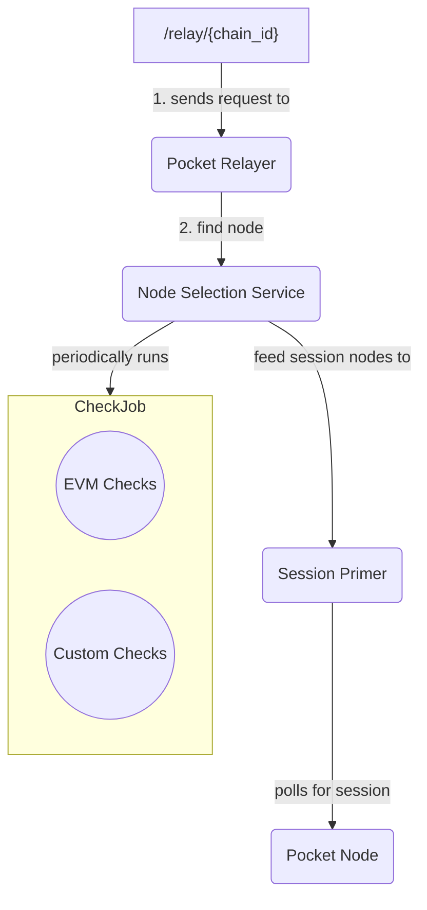

# Node Selection

## Session Management

The Gateway Server under the hood will asynchronously call a POKT full node for a session and cache the session. Caching is an optimization given that a session only changes periodically (4 blocks/60 mins).



## QoS Controls

The Gateway Server determines if a set of nodes are healthy based off a simple weight formula with the following heuristics:

* Latency
* Success Responses
* Correctness in regard to other node operators.
* Liveliness (Synchronization)

### Node Selector&#x20;

After the sessions are primed, the nodes are fed to the `NodeSelectorService` which is responsible for:

1. Running various QoS checks (Height and Data Integrity Checks)
2. Exposing functions for the main process to select a healthy node `findNode(chainId) string`

#### Checks Framework

The gateway server provides a simple interface called a `CheckJob`. This interface consists of three simple functions.

```rust
type CheckJob interface {
  Perform()
  Name() string
  ShouldRun() bool
  }
```

Under the hood, the NodeSelectorService is responsible for asynchronously executing all the initialized `CheckJobs`.

Some existing implementations of Checks can be found in:

1. [evm\_data\_integrity\_check.go](https://github.com/pokt-network/gateway-server/blob/main/docs/..%2Finternal%2Fnode\_selector\_service%2Fchecks%2Fevm\_data\_integrity\_check%2Fevm\_data\_integrity\_check.go)
2. [evm\_height\_check.go](https://github.com/pokt-network/gateway-server/blob/main/docs/..%2Finternal%2Fnode\_selector\_service%2Fchecks%2Fevm\_height\_check%2Fevm\_height\_check.go)

#### Adding custom QoS checks

Every custom check must conform to the `CheckJob` interface. The gateway server provides a base check that developers should inherit:

```rust
type Check struct {
NodeList           []*qos_models.QosNode
PocketRelayer      pokt_v0.PocketRelayer
ChainConfiguration chain_configurations_registry.ChainConfigurationsService
}
```

This base check provides a list of nodes to check and a `PocketRelayer` that allows the developer to send requests to the nodes in the network, and `ChainConfiguration` service that allows for per-chain specific check configurations.

Checks are designed to be opinionated and there are numerous ways to implement whether a node is healthy or not by definition. Therefore, implementing custom QoS checks will be dependent on the chain or data source the developer is looking to support. For example, the developer may want to send a request to a Solana node with a custom JSON-RPC method to see if the node is synced by using the provided `PocketRelayer` to send a request to the node through Pocket network. If the node is not synced, the developer can set a custom punishment through the various functions exposed in [qos\_node.go](https://github.com/pokt-network/gateway-server/blob/main/docs/..%2Finternal%2Fnode\_selector\_service%2Fmodels%2Fqos\_node.go), such as `SetTimeoutUntil` to punish the node.

Once the developer is finished implementing the CheckJob, they can enable the QoS check by initializing the newly created check into the `enabledChecks` variable inside [node\_selector\_service.go](https://github.com/pokt-network/gateway-server/blob/main/docs/..%2Finternal%2Fnode\_selector\_service%2Fnode\_selector\_service.go) and are encouraged to open up a PR for inclusion in the official repository.

### Future Improvements

* Long term persistent results
  * Pros: More data to work with on determining if a node is healthy
  * Cons: Expensive, more complex logic, and can be punishing to new node operators
* Rolling up the results for long term storage & historical look back
