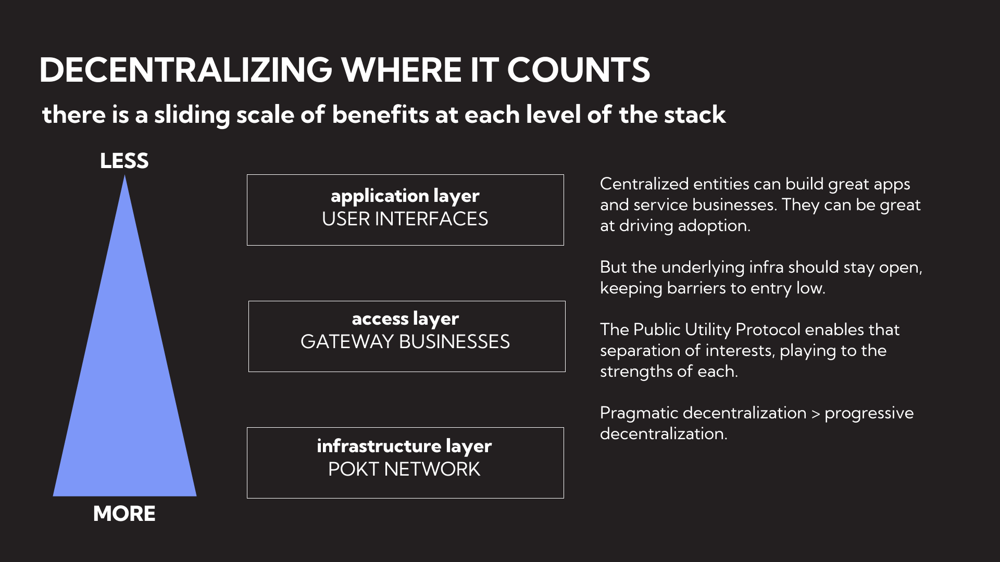

# Gateways

### What are Gateways?

Gateways are services built on top of POKT Network, making it easier for all types of users to access POKT, and adding addition UX features. POKT Network realized, early on, that Gateway-like services will be on the cutting edge of features users will need, so with Shannon, POKT Network is bringing them on-chain.

### Why Gateways In The First Place?

POKT Network is unique within the DePIN and larger utility token space due to its strategy around Gateways. But what exactly is a Gateway?

#### The UX Challenge

Most criticisms around web3 utility tokens revolve around their user experience (UX). When compared to their centralized counterparts, web3 alternatives tend to be lacking in several key areas:

1. Complicated onboarding process
2. Limited features
3. Slow feature development
4. Inconsistent service
5. Fluctuating costs due to token value changes

To avoid falling into the same pitfalls as other projects, POKT Network is designed to provide a distinct access layer, known as Gateways. These allow users to connect to POKT Network without having to interact directly with the protocol.

This design decision comes as a result of maintaining a MainNet with a growing ecosystem since 2020, as we are paving the path we anticipate other projects will follow.

#### Changing UX With An On-chain Access Layer

Gateways connect users to POKT Network. They offer developers the same UX they would expect from centralized services, but with an unstoppable permissionless backend powered by POKT Network.

Gateways are businesses whose incentives are to add new features and attract new users. POKT Network takes care of the complex backend, allowing Gateways to focus entirely on user experience and optimized performance.

For example, POKT Network is being used by Raid Guild to build a unique infrastructure service for their community. Similarly, an existing service like Liquify uses POKT to offer their users access to more features. Grove, the first Gateway on POKT Network, recently raised $7.9M based entirely on being a POKT Network Gateway.

#### Unlimited Utility

<figure><figcaption></figcaption></figure>

If POKT Network has an unlimited Access layer, then there are no limitations on its potential reach. Shannon allows for permissionless Gateways to be part of the protocol itself, enabling POKT Network to truly be the universal infra layer for an unlimited number of user experiences.

For web3 services to outperform their web2 counterparts, they must offer superior UX. POKT Network understands this at a protocol level.

### Morse Vs Shannon Gateways

|                             | Morse                                  | Shannon       |
| --------------------------- | -------------------------------------- | ------------- |
| On-chain payments           | ❌ (Manual burns by the DAO)            | ✅ (supported) |
| Permissionless staking      | ❌ (Must be approved by PNF)            | ✅ (possible)  |
| Self-dealing susceptibility | ❌ (Avoided through trusted federation) | ✅ (avoided)   |
| On-chain scalability        | ❌ (Number of gateways is limited)      | ✅ (non-issue) |

### Shannon Gateways

Shannon provides gateways with on-chain and permissionless access. This enables POKT Network's demand side to grow without the restraints required under Morse. Major features from the start will include:

1. Permissionless staking
2. On-chain payments
3. On-chain delegation (from applications to gateways)
4. Tools for easy onboarding and Quality of Service (QoS)

#### Gateway Staking

_Gateway staking in Shannon will likely differ from most staking practices in web3. As Shannon's tokenomics continues to mature, there will likely be changes, but for now, this is where the team stands._

How Gateways interact with the POKT token will be crucial to POKT adoption. In the context of DePIN, token interaction can often be the most challenging part of using a protocol.

With this in mind, the goals for Gateway Staking are:

1. Minimal protocol interactions
   1. Allow Gateways to interact with POKT as little as possible, thereby reducing friction.
2. Consistent Costs in USD
   1. Since Gateways are businesses, they need predictable costs. The cost per relay needs to be pegged to a USD value, even while the price of POKT fluctuates.

Gateway staking could be as simple as a 'pre-pay' system to meet these goals. When a Gateway stakes POKT, that stake credits the account with a certain number of relays based on the POKT price at that time. As the relays are used, the stake is burned accordingly.

This system allows Gateways to 'pre-pay' for as many relays as they need and ensures predictable costs. Third-party tools could make this relay pre-paying even simpler using wPOKT.

We believe POKT Network can be the first DePIN protocol to abstract away the complexities of the native token and provide businesses with USD-based pricing while still increasing the core utility and value the POKT token.
