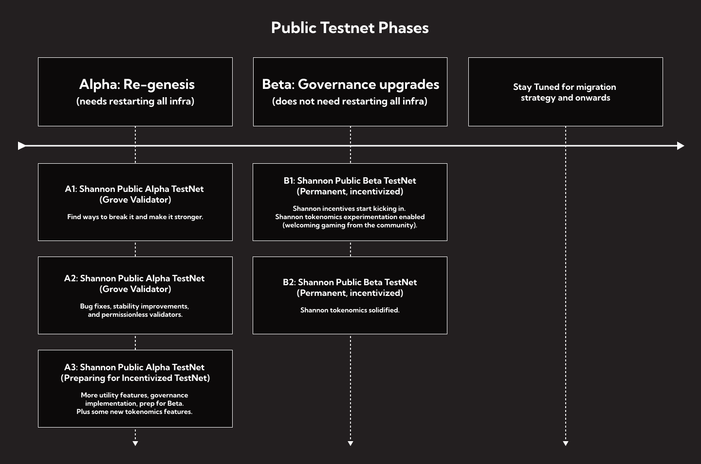

# Launch Roadmap

## Testnet Roadmap&#x20;

You can access the latest version of Shannon's Roadmap [here](https://github.com/orgs/pokt-network/projects/144?query=is%3Aopen+sort%3Aupdated-desc).​

### Testnet Launch

The public Testnet is structured in phases, each providing specific areas of focus and unique milestones. The main goal of each phase is to break, learn, iterate and rebuild stronger with community involvement.&#x20;

A rewards system for contributors including new [bounties](../../../community/start-contributing/bounties.md) will be announced. We encourage you to help identify areas for improvement. POKT has a proud tradition of community contributions that substantially improved the protocol, and we hope to draw on this throughout the Testnet phases.

<figure><figcaption></figcaption></figure>

#### Our Priorities for launch

<strong>Limits of permissionless demand</strong>

One of the core reasons we are moving from \`_Morse_\` to \`_Shannon_\` is to enable the scalability needed for permissionless demand.\
\
The team is working on tooling so we can load-test it and start finding potential bottlenecks. We are excited to share what we believe is one of the best E2E load-testing frameworks across the entire industry.

<strong>Governance Parameters</strong>

In order to migrate existing functionality and add new functionality, we need to add support for Governance parameters that are compliant with the new Cosmos SDK. We are hard at work on getting this done ASAP.

<strong>Explorers &#x26; Faucets</strong> 

In order for anyone to interact with or explore the new network, we need visibility tooling. Luckily, using the Cosmos SDK opens up access to existing tools and our community is actively working on co-opting those!

<strong>Images &#x26; Binaries</strong> 

No one wants to build from scratch every time. We'll integrate with the [Cosmos Operator ](https://github.com/strangelove-ventures/cosmos-operator)to provide binaries and images for every POKT Shannon actor so that it's seamless for existing operators to test the new network as well as for onboarding new ones.

A re-genesis will occur in the coming weeks to launch the official Public Testnet. However, early adopters who aren’t afraid of bugs can start getting familiar with deploying and running using this [docker-compose guide](https://github.com/pokt-network/poktroll-docker-compose-example) today! Bounties and incentives for improving tooling for Public Testnet will be announced soon.

## Mainnet Launch

Every design decision is focused on allowing POKT Network to optimize core utility, abstracting away anything that doesn’t directly benefit its DePIN business, while enabling Shannon to be modular by nature and to natively integrate and interoperate with other ecosystems in Web3.

We hoped to be able to abstract away the validation layer entirely and deploy fully as a rollup on Celestia’s emerging tech, but we built pragmatically in a way that gave us a fallback to a new Cosmos SDK that was a strong alternative (full analysis [here](https://www.pokt.network/blog/rolling-into-the-modular-future) released in September 2023).&#x20;

Celestia’s ecosystem is developing rapidly but, in this instance, not rapidly enough for us to launch as a full rollup. POKT Network will therefore launch with the Cosmos SDK backed by CometBFT's PoS consensus engine, which will enable it to use Rollchains and settle its blocks on other data availability layers such as Celestia for added security. These changes will set back our Mainnet timeline but will allow interoperability with both IBC and Celestia ecosystems. The Rollchains module will be added in later testnet phases.

Here is the updated timeline, with Mainnet launch now targeted for later this year.

<figure><figcaption></figcaption></figure>
