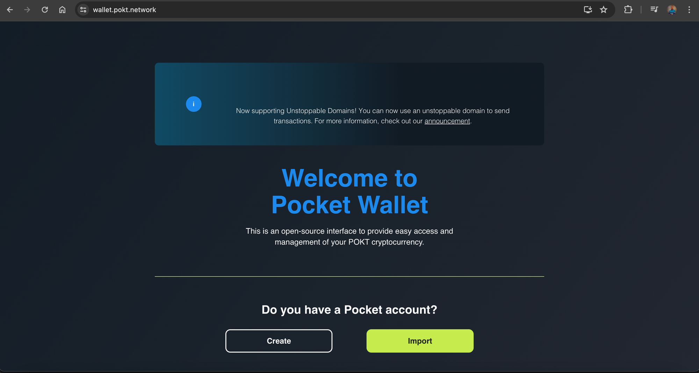
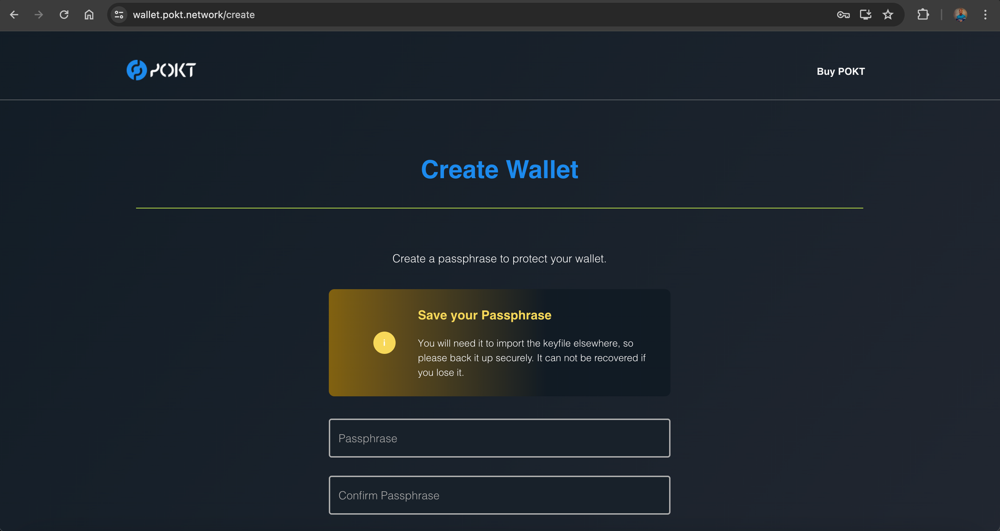
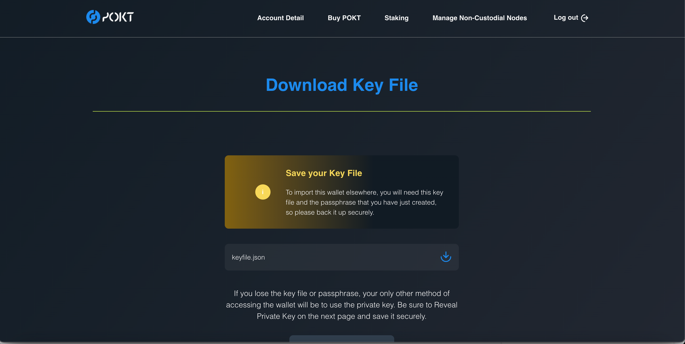
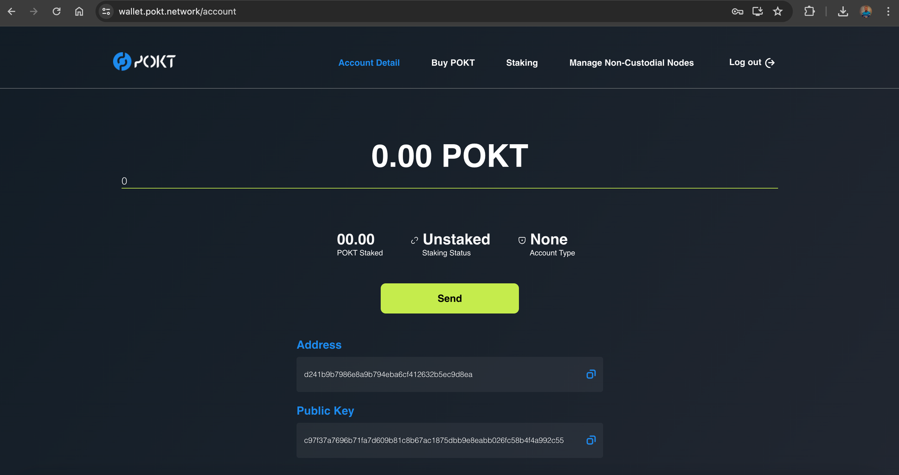

# Pocket Wallet

You can use the [official wallet web app](https://wallet.pokt.network/) to create your wallet.  With an open-source interface, Pocket Wallet allows you to easily send, receive, and non-custodially stake your POKT tokens.

## Creating a Pocket Wallet

### Video Guide:



***

### 1. Visit the Pocket Wallet website

Using any browser, navigate to [https://wallet.pokt.network](https://wallet.pokt.network). Click `Create` to start the process of setting up a new wallet.

<figure><figcaption>
visit the site
</figcaption></figure>

### 2. Create your wallet:

<figure><figcaption></figcaption></figure>

Next, enter a passphrase. This passphrase can be used to decrypt the keyfile that will be created in the next step.


Make sure your passphrase has no fewer than 8 characters, a mixture of letters and numbers including at least one uppercase letter and at least one special character, e.g., ! @ #


After entering your passphrase, click `Create` to move to the next step.

### 3. Save your Keyfile:

<figure><figcaption></figcaption></figure>


This is a vital step that ensures you don’t lose access to your wallet. Make sure to back up your keyfile and save your passphrase securely.


Once you've downloaded the keyfile, press `Continue`to complete the wallet creation process.

### Welcome to the POKT ecosystem&#x20;

<figure><figcaption></figcaption></figure>
