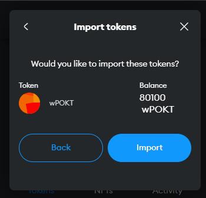

# DAO (OS)

### Role of the POKT DAO

The role and power of the POKT DAO, the Pocket Network Foundation (PNF) and its voters are set out in our [constitution](https://github.com/pokt-network/governance/blob/12949c5060638591accd2ba07f07626426723c26/constitution/constitution.md) and [articles of association](https://github.com/pokt-network/governance/blob/12949c5060638591accd2ba07f07626426723c26/foundation/Pocket-Network-Foundation-Articles-of-Association-Highlighted.pdf).

In simple terms, the role of the POKT DAO is to be a place for all stakeholders in the ecosystem to coordinate on important questions and decisions and to uphold and proliferate the POKT DNA.

### Strategy of the POKT DAO

The strategy of the POKT DAO is defined by PNF periodically (each Era) and the mandate is supported through the activation of the funding mechanisms required to deliver on it.

The current strategy of the POKT DAO is defined in the [PNF Strategy thesis](https://docs.google.com/document/d/1D-JDGTFbCMsDR-488cRCWRrG0am4Tg\_oaJWslJcnVC0/edit#heading=h.o0jys8nqwju5).

#### Ambitions of the POKT DAO

The POKT DAO currently has 5 major Ambitions (sometimes referred to as Big Hairy Audacious Goals) that orient the way we prioritise funding and attention. These ambitions are defined here:

<figure><figcaption></figcaption></figure>

* Pocket’s V1 is he most success new protocol launch ever
* Pocket has $1B of annual protocol revenue
* Pocket has the most trusted infrastructure brand in crypto
* Pocket has the healthiest culture and governance of any DAO
* Pocket has the institutional financial rails of a blue-chip token

These ambitions all align towards our _**North Star**_, which is Protocol Revenue.

### Operations of the POKT DAO

#### The Era

To DAO aligns behind these ambitions through a mechanism called an Era. The Era is a milestone based objective which creates a shared and definable objective for the Era. The objective for the current Era is the launch of the protocols [Shannon Upgrade](https://docs.pokt.network/readme/our-protocol/shannon)

The Era aligns focus and funding mechanisms and aims to remove the proxy strategy debates that many DAOs fall into by conflating resource allocation decisions with strategy. We have articulated other [known DAO problems](https://docs.google.com/document/d/1RETQRH2cgzn3\_72JmF5xr0LW7sIsVyjCmiRY3-wrq3E/edit#heading=h.iif52hhnu202) that we always seek to avoid.

#### Quarter Cycles

Because we operate under a milestone based Era for revisiting strategy, we use quarterly Cycles as an opportunity for introspection and retrospective discussion that allows learning and iteration. To be clear, cycles remove the cyclical funding questions of individual projects which are generally disruptive to a primary focus on execution.

#### Funding and Budgeting

The Era Budget is activated at the beginning of the Era and describes the primary budgets within the DAO. There are two main components to this - The Era Budget and the Era Allocation.

Our Era reports come out each quarter to the forum. [Q4 2023 Era Cycle Report - Cycle 3](https://forum.pokt.network/t/era-cycle-report-cycle-3/4960)

**Era Budget**

The Era budget defines a set of Keystone Projects which PNF execute in tandem with community contributors and other teams. This budget is Fixed and allows the DAO to keep the foundation accountable to budgets set upfront for completing work.

**Era Allocation**

The Era Allocation defines the rules through which community contributions can access funds without direct request (proposals) to the DAO. It is Variable and allows the funding for community contributions and grants to scale up or down based on the block rewards of the DAO. It also provides a defined set of community funds that are available each cycle, creating predictability for budgets but also contributors. It is reset each cycle.

**Accessing Funds**

Funds are accessed by contributors through the [Contributions programs](https://docs.pokt.network/contribute) of the DAO.

#### Proposals

Proposals are an important part of DAO operations but are generally reserved for important questions not already covered by the DAOs strategy, or for resource allocation and funding decisions which are not specifically aligned to the DAOs stated Ambitions.

Proposals are split into three categories:

**PEPs (Pocket Ecosystem Proposals)**

These distribute funds to or from agreements with contributors to the POKT Network ecosystem. PEP categories include: Imbursements, Reimbursements, Bounties, Transfers, and Agreements. Each PEP is given a unique number as a suffix (such as [PEP-13](https://forum.pokt.network/t/pep-13-poktscan-app/)).

**PIPs (Pocket Improvement Proposals)**

These upgrade any facet of Pocket Network, including protocol and governance updates. Each PIP is given a unique number as a suffix (such as [PIP-11](https://forum.pokt.network/t/pip-11-implementing-an-on-chain-rev-share-mechanism/)).

**PUPs (Parameter Update Proposal)**

These change the value of a given protocol parameter, either on-chain or in various tools or platforms. Each PUP is given a unique number as a suffix (such as [PUP-11](https://forum.pokt.network/t/pup-11-wagmi-inflation/))

#### Permissions

The DAO should operate optimistically and with only very lite permissions for supporting pursuit of our stated ambitions. In this way we reduce barriers to entry, bring our focus to evidence over confidence, and enable the creativity and innovation of our community to bloom.

Permissions ensure that people who are already contributing or have demonstrated reputation in the community do not have new hurdles to participate.

For new contributors, the alignment we require most is to our Pocket DNA and understanding our DAO OS and Contribution mechanisms. You can find more detail on how to upscale your knowledge of these on the relevant docs pages or within the Governance section of the DAO itself.

#### Payments

The DAO continues to evolve and update its payment operations and aims to do so in the most transparent way possible. Unless otherwise stated the main details related to payments that you should know are:

_**Schedule:**_ Recurring Payments from the DAO are made on a monthly basis on the first date of governance transactions each month (generally first Tuesday of each month).

For recurring payments from the Era funding mechanisms we aim to make payments within 7 days, and recurring contibutors from the Era Allocation receive payment streams via [Hedgey Finance](https://app.hedgey.finance/).

_**Calculation:**_ Payments are generally made based on the prevailing 30 day average POKT price, where pricing has been stated in USD terms.

Method: DAO transactions are made direct to the relevant POKT wallet. Era payments are made direct from the relevant multisig either directly to an Eth wallet, or streamed via [Hedgey Finance](https://app.hedgey.finance/).

***

_This is an evolving and possibly incomplete record of the DAOs OS. Faster learning beats better planning, so please help us learn of any gaps or challenges related to any of the above_ 🫂
