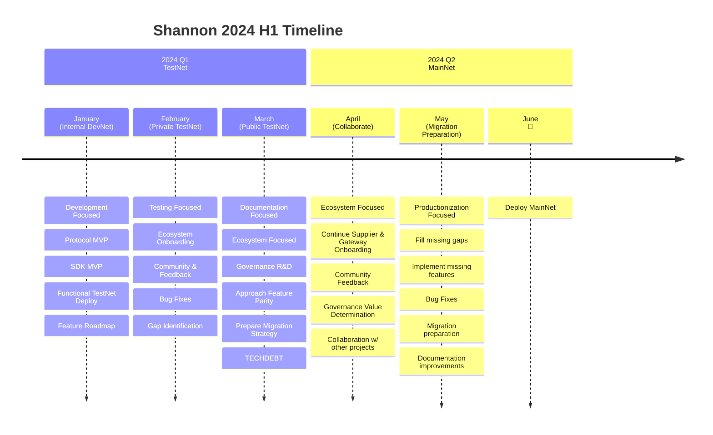
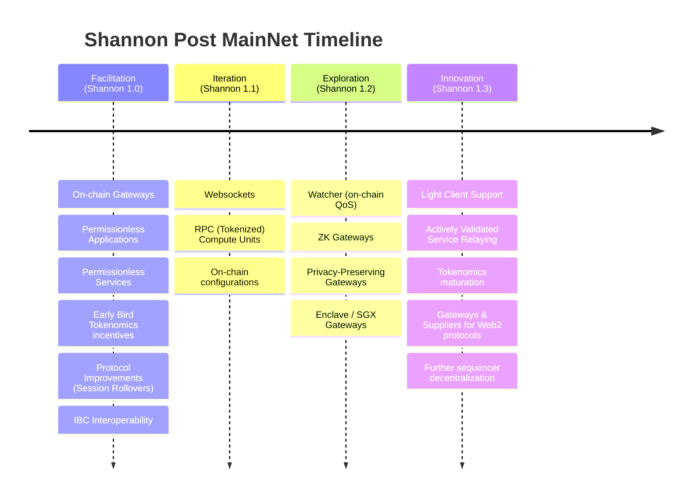
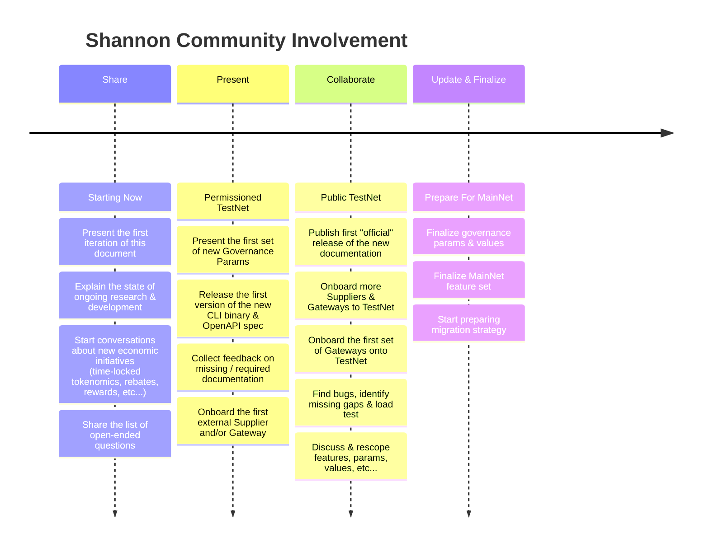

# Shannon Roadmap

This page tracks the progress and updates of Shannon's Roadmap.

* [2024/01/18](roadmap.md#20240118)
  * [Road to mainNet](roadmap.md#road-to-mainnet)
  * [MainNet Features](roadmap.md#mainnet-features)
  * [Feedback Iteration](roadmap.md#feedback-iteration)

## 2024/01/18

You can find the recording [here](https://youtu.be/-BUoS0yusfI) and the presentation [here](https://docs.google.com/presentation/d/1IOiIZjY192RP9FkI1nXdV4I7YcuNkrSIKFIVs25M-TM/edit).

### Road to mainNet

### MainNet Features

### Feedback Iteration

Test

